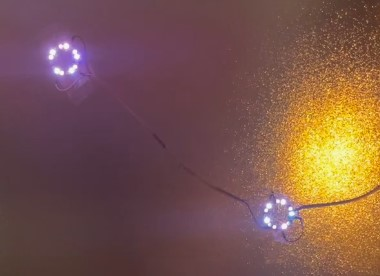

# Rueda Led  

Autor: Jordi Rodríguez  
  
Control de 2 ruedas Led en serie desde Arduino  
Para la programación usaremos la plataforma Arduino IDE:  

https://www.arduino.cc/en/software  

Se han incluido las siguientes librerías:  

- Adafruit_NeoPixel
https://github.com/adafruit/Adafruit_NeoPixel  

  
  
  

## Material utilizado  

- 2 x WS2812B = Anillo RGB 16 led   
- Arduino UNO  
  

## Pines de conexion  

A0 =  
A1 =  
A2 =  
A3 =   
A4 =  
A5 =  
D0 = (RX)  
D1 = (TX)  
D2 = (INT0)  
D3-= (INT1)  
D4 =     
D5-=  
D6-= Signal  
D7 =  
D8 =  
D9-=  
D10-=  
D11-=  
D12 =   
D13 =  